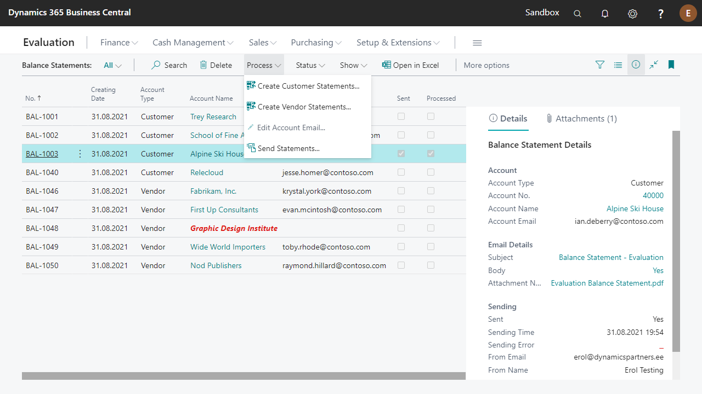

---
---
# Balance Statements - User Guide

Balance Statement functionality makes possible to send **Balance Statement confirmations** to customers and vendors.  
Also in Fixed assets list user can view **FA Balance** (Physical Inventory List) report.  

 

## Verify Balance Statement Installation
Open **Extension Management** and check if extension named ‘Balance Statement’ is installed. If not, please find and install it from <a href="https://appsource.microsoft.com/en-us/product/dynamics-365-business-central/PUBID.estonian_dynamics_partners%7CAID.balance-statements%7CPAPPID.2c6e9797-3574-4828-b075-ef340322f94c" target="_blank">AppSource</a> or contact your partner.

 

## Setup
**Open Balance Statements Setup.**

|**Field**|**Explanation**|
|-|-|
|Balance Statement Nos.|Enter new number series you want to use for Balance Statements.|
|Customer Email Layout Code|CUST-EMAIL-by default, but user can modify for company needs.|
|Vendor Email Layout Code|VEND-EMAIL by default, but user can modify for company needs.|
  
Use **Customize Statement Texts** to create, view or edit customized statement texts for different languages.  
  
 

## Balance Statements 
Open **Balance Statements**.

## How to create Customer/Vendor Statements

_The creation process of customer and vendor balance statements is identical._  
Click **Process -> Create Customer/Vendor Statements**

|**Field**|**Explanation**|
|-|-|
|Balance Date|The balance (standing) date.|
|Returning Date|The date user wants Customer/Vendor response.|
|Include details|Specifies if list of entries, that form the outstanding amount, is included on the statement.|
|Use Ext. Doc. No. as Doc. No.|Specifies if External Document No. is used as Document No. on balance statement (if possible).|
|Print In LCY|Specifies if outstanding amount is shown converted to Local Currency only or for each currency separately.|
|Issued By|If specified selected employees information will be added to the signature.|
 
Click **OK** to create statements.

Statements in red mean they are missing Account Email (or have some other error that makes them not sendable).
**You can add/change Account Email with action "Edit Account Email..."** and also save it to customer/vendor card (_exept statements with status Processed_).  

On the factbox user can open PDF of the statement:

 

You can change the design of PDF file and email message body on page **Report Layout Selection**:

|**Report ID**|**Report Name**|
|-|-|
|24012100|Customer - Balance Statement|
|24012101|Vendor - Balance Statement|

 

## How to Send Statements
Before sending the statements for the first time, please make sure that **Email Scenario Assignment** has been configured.  
Balance statements are sent from Email account that has scenario **Balance Statement** assigned. If latter is not assigned, then default Email account is used.  

Click **Process-> Send Statements**

|**Field**|**Explanation**|
|-|-|
|**Email Addresses:**||
|From|Specifies the account to send the email from. Account is determined on page Email Scenario Setup.|
|Cc|Specifies the email addresses of people who should receive a copy of the email.|
|Bcc|Specifies the email addresses of people who should receive a blind carbon copy (Bcc) of the email. These addresses are not shown to other recipients.|
|Test To|If specified, this address is used instead of Account Email. Can be used for testing.|
|Open in Compose an Email|Specifies if Balance Statement(s) are opened in Compose an Email page before sending. Note! Balance statement is marked sent even when email is discarded on Compose an Email page.|
|**Filters:**||
|No.|By default selected balance statement(s) is(are) filtered. To send all the statements remove the filter for this field.|

Click **OK** to send the statements.  
Successfully sent Balance statements are marked as **Sent**.  
User can also find the sent statements from **Sent emails** under respective customer/vendor.  

 

## Set Statements Status to Processed
After the feedback from your business partners, User can mark statements as **Processed**.  
Also user can attach **Attachments** and **Notes** to the statements.  

 

## FA Balance (Physical Inventory List)
User can find the **FA Balance** report on Fixed asset list, in reports section (under More options).  

The report shows a list of fixed assets on a specified balance date and user can also use this report to make fixed asset inventory.  

|**Field**|**Explanation**|
|-|-|
|**Options:**||
|Depreciation Book|Specifies the code for the depreciation book to be included in the report or batch job.|
|Document No.|Specifies the number of the document.|
|Balance Date|Specifies the date to which the report or batch job processes information.|
|Print FA financial info|Specifies if financial information (Acquisition cost, Depreciation, Book value) is displayed instead of general (class, subclass etc) information.|
|Include FA with Zero Book Value|Specifies if fixed assets with zero book value are included in the report.|
|Group by|Specifies if you want the report to group fixed assets and print totals using the category defined in this field.|
|New Page Per Group|Specifies if you want each group printed on a new page.|
|**Committee members:**|You can select up to 3 inventory committee members from employees|
  
 

For more information, please contact one of the partners:  
<a href="http://www.dynamicspartners.ee/" target="_blank">www.dynamicspartners.ee</a>
