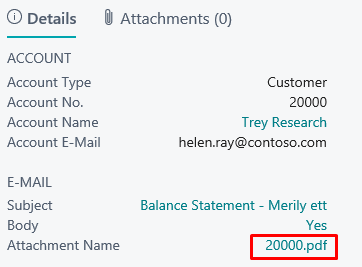

---
---
# Balance Statements - User Guide

Balance Statement functionality allows user to send Balance Statement information to customers or vendors and track their confirmations.

## Verify Balance Statement Installation
Open **Extension Management** and check if extension named ‘Balance Statement’ is installed. If not, please find and install it from AppSource or contact your partner.

## Setup
**Open Balance Statements Setup.**

|Field|Value|
|-|-|
|Balance Statement Nos.|Enter new number series you want to use for Balance Statements.|
|Customer E-mail Layout Code|CUST-EMAIL-by default, but user can modify for company needs.|
|Vendor E-mail Layout Code|VEND-EMAIL by default, but user can modify for company needs.|

## Balance Statements 
Open **Balance Statements**.

## How to create Customer Statements
Click **Process-> Create Customer Statements**

|Field|Value|
|-|-|
|Balance Date|The date user wants Customers balance.|
|Returning Date|The date user wants Customers response.|
|Print In LCY||
|Issued By|If specified, his/her contact information will be added to the signature.|
 
Click **OK** to create statements.

On the factbox user can open PDF of the statement:

## How to create Vendor Statements
Click **Process-> Create Vendor Statements**

|Field|Value|
|-|-|
|Balance Date|The date user wants Vendors balance.|
|Returning Date|The date user wants Vendors response.|
|Print In LCY||
|Issued By|If specified, his/her contact information will be added to the signature.|

Click **OK** to create statements.

On the factbox user can open PDF of the statement:

## How to Send Statements
Before seding the statements, please make sure **SMTP Mail Setup** has been configured.

Click **Process-> Send Statements**

|Field|Value|
|-|-|
|Options:||
|From Address|Enter e-mail from which statements will be sent. It depeneds on your SMTP server setup if you are required to use address from **SMTP Mail Setup** or you can use a different address.|
|Filters:||
|No.|By default current balance statement is filtered. To send all the statements remove the filter for this field.|

Click **OK** to send the statements.

## Set Statements Status to Processed
After the feedback from your business partners, you can attach **Notes** to the statements and mark statements as **Processed**.

For more information, please contact one of the partners:  
[http://www.dynamicspartners.ee](http://www.dynamicspartners.ee)

