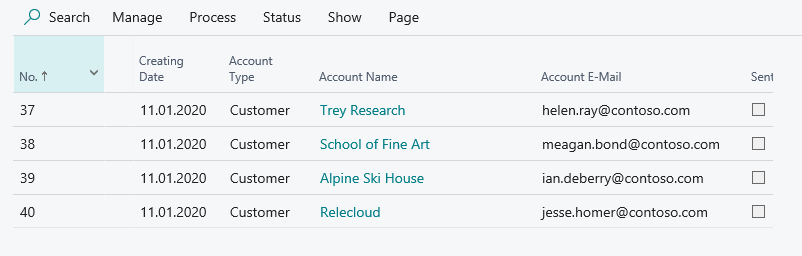
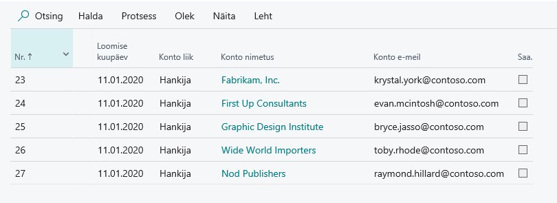

# Saldoteatis- Kasutusjuhend

Saldoteatise funksionaalsus võimaldab kasutajal saata klientidele/hankijatele saldoteatised vastavalt enda valitud kuupäevale ning jälgida nende kinnitamisi.

## Saldoteatise api tuvastamine
Ava **Laiendused** ja veendu, et app ‘Saldoteatised’ on alla laetud. Kui pole, võid selle leida AppSourcest või võta ühendust oma partneriga.

## Seadistused
**Ava otsingust Saldoteatiste seadistused**

|Välja nimi|Kasutamine|
|-|-|
|Saldoteatiste numbrid|Seadista endale soovitud saldoteatise numbriseeria.|
|Kliendi e-kirjade kujunduse tähis|CUST-EMAIL- sisse ehitatud aruanne, võimalik modifitseerida vastavalt enda vajadustele.|
|Hankija e-kirjade kujunduse tähis|VEND-EMAIL  sisse ehitatud aruanne, võimalik modifitseerida vastavalt enda vajadustele.|

## Saldoteatised
Ava otsingust **Saldoteatised**.

## Kuidas luua kliendi saldoteatiseid
Kliki **Protsess-> Loo kliendi teatised**

|Välja nimi|Kasutamine|
|-|-|
|Saldo kuupäev|Määrab ära, mis kuupäevani saldo kuvatakse.|
|Tagastamise kuupäev|Kuupäev, mis ajaks oodatakse vastust.|
|Prindi KV-s||
|Väljastaja |Kui täpsustatud kontakti nimi, lisatakse see saldoteatisele.|
 
Kliki **OK** Klientidele saldoteatised on loodud.

Saldoteatise PDF leiad kiirinfo väljalt, kus vajadusel saad selle ka avada:

## Kuidas luua Hankijate saldoteatised
Kliki **Protsess-> Loo hankija teatised**

|Välja nimi|Kasutamine|
|-|-|
|Saldo kuupäev|Määrab ära, mis kuupäevani saldo kuvatakse.|
|Tagastamise kuupäev|Kuupäev, mis ajaks oodatakse vastust.|
|Prindi KV-s||
|Väljastaja |Kui täpsustatud kontakti nimi, lisatakse see saldoteatisele.|

Kliki **OK** saldoteatised on loodud.

Saldoteatise PDF leiad kiirinfo väljalt, kus vajadusel saad selle ka avada:

## Kuidas saata Saldoteatiseid
Enne, kui hakkad saldoteatiseid välja saatma, palun veendu, et  **SMTP-posti seadistused ** on tehtud.

Kliki **Protsess-> Saada teatised**

|Välja nimi|Kasutamine|
|-|-|
|Valikud:||
|Saatja aadress|Siia sisesta emaili aadress, mille pealt saldoteatised välja saadetakse. Sõltub **SMTP seadistusest**, kas saab saata ainult sinna määratud aadressilt või saab kasutada erinevaid aadresse.|
|Filtrid:||
|Nr.|Vaikimisi on filtreeritud see saldoteatis, mille pealt e-maili saatma hakkasid. Kui soovid saata kõik saltoteatised korraga, eemalda filter.|

Kliki **OK**, saldoteatised on välja saadetud.

## Pane linnuke saldoteatiste taha Saadetud.
Hiljem, kui äripartnerid on vastanud, on võimalik igale saldoteatisele lisada **manuseid** ja **märkmeid** ning märkida teatis **töödelduks**. 

Lisainformatsiooni saamiseks pöördu partneri poole:  
[http://www.dynamicspartners.ee](http://www.dynamicspartners.ee)

