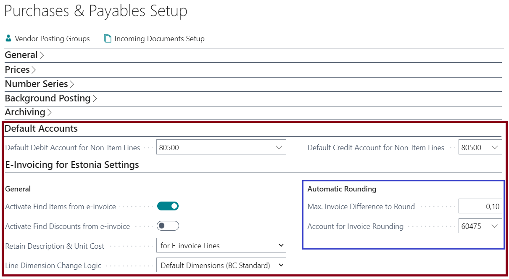

---
---
# E-Invoices for Estonia - User Guide
E-Invoices for Estonia solution allows to exchange e-invoices with your business partners. As a prerequisite, you must have entered into a corresponding contract with one of the e-invoice operators Finbite (formerly Omniva) or Unifiedpost (formerly Fitek).

## Table of Contents
  - [Service Setup](#service-setup)
  - [Job Queue Entries](#job-queue-entries)
  - [Data Exchange Activities Log](#data-exchange-activities-log)
  - [Receive E-Invoices](#receive-e-invoices)
  - [Create Purchase Invoice from E-Invoice](#create-purchase-invoice-from-e-invoice)
  - [Send E-Invoices](#send-e-invoices)
  - [Send Master Data to Finbite](#send-master-data-to-Finbite)

 

## Service Setup
Open **Finbite (Omniva) Document Exchange Service Setup** or **Unifiedpost (FitekIn) Document Exchange Service Setup** and configure the following fields:

|Fast tab / Field|Explanation|
|--|--|
|**General**||
|Enabled|Activates the service and creates **Job Queue Entries** to automate data exchange.|
|Key User|Notifications of errors of automatic data exchange will be sent to his/her role center.|
|Activity Logging|Determines the level of detail for data exchange activity logging. During the test period it is advisable to use "Activity Message and XML Message" to get the maximum information to solve problems. Logged activities and messages can be viewed on the page **Activity Log**.|
|**Connection**|To setup default values for connection, you can use action **Set URLs to Default**.|
|Service URL|For Finbite you can find it in Finbite invoicing management environment under the Settings->Settings->Data Exchange with ERP.|
|Service Namespace URL|Usually no need to change default value.|
|SOAP Namespace URL|Usually no need to change default value.|
|Authentication Phrase (Finbite only)|You can find it in the Finbite invoicing management environment under the Settings->Settings->Data Exchange with ERP.|
|User Name (Unifiedpost only)|Ask from Unifiedpost.|
|Password (Unifiedpost only)|Ask from Unifiedpost.|
|**Documents** (Finbite only)||
|Get Invoices Changed Since|Document exchange internal bookmark. Not editable.|
|Get Invoice Which Are|Receive invoice if status is:   a) Processed - invoice is marked as Ready for sending to ERP.   b) Received - invoice is received as soon as they arrive to Finbite.   c) Confirmed - invoce has been approved in Finbite invoice management.
|Get Invoice Attachments|Specifies whether the attachents of the e-invoice are taken. „Main Attachment“ is usually invoice as a PDF.|

To test the connection, use action **Test Connection**.

 

## Job Queue Entries
**Job Queue Entries** for automatic data exchange are created when the service is enabled. To view job queue entries, click **Job Queue Entries** in the service setup. 

|Data Exchange Job|Explanation|
|--|--|
|Send GL Accounts|Sends G/L accounts with checkmark **Send to Finbite**.|
|Send Dimensions|Sends dimensions with checkmark **Send to Finbite**.|
|Send Vendors and Customers|Sends vendors and customers with checkmark **Send to Finbite**.|
|Get Purch. Invoices|Takes invoices from the operator server and saves to **Incoming Documents**.|
|Send Posted Purch. Invoices No.|Sends posted purch. invoice number for Finbite incoming documents.|
|Send Queued Sales Invoices|Sends sales invoices which **Document Exchange Status** is „Waits for Sending“ or „Sending Error“. Customer must have **Document Sending Profile** which has setup **Estonian E-Invoice**.

Set the desired frequency and activate the jobs with action **Set Status to Ready**.

Manually you can run data exchange activities from the **Finbite Document Exchange Setup** or **Unifiedpost Document Exchange Setup** actions ribbon.

 

## Data Exchange Activities Log
All data exchange activities are logged. In case of error, these help you in solving the problem. Data exchange activity log entries are linked to the underlying data as follows:

|Data record / Page|Data Exchange Activity|
|--|--|
|Finbite (/Unifiedpost) Document Exchange Service Setup|-Send G/L accounts and dimensions   -Send vendors and customers   -Get purch. invoices batch|
|Incoming Document|-Get purch. invoice attachments   -Send posted purch. invoice no.|
|Posted Sales Invoice (or credit memo)|-Send sales invoice|

To view log entries, click **Activity Log** on the service setup or on a document.

 

## Receive E-Invoices
Receiving e-invoices is normally an automated activity. To check this, open **Finbite (/Unifiedpost) Document Exchange Setup**, make sure it is **Enabled**, and click **Job Queue Entries**. Open the job „Get Purchase Invoices“ and make sure it is set up and running the way you want.

If you want to run receiving e-invoices manually, you can do so by clicking **Get Purch. Invoices** on the service setup page.

Received e-invoices are stored to the table **Incoming Documents**.

 

## Create Purchase Invoice from E-Invoice

Functionality of the solution (inc. invoice creation logic and retaining line information) can be specified on **Purchases & Payables Setup**:

- In fast tab **Default Accounts** you can specify a G/L account that is automatically inserted on purchase lines that are created from e-invoices when the line does not contain an identifiable G/L account or item (look below point 5).
- In fast tab **E-Invoicing for Estonia Settings** you can:
  - Activate find items from e-invoice functionality (look below point 2)
  - Activate find discounts from e-invoice functionality (look below point 7)
  - Specify logic to retain information on purchase line (look below Retain Line information specification)

**Process:**

Open **Incoming Documents**. Select the received e-invoice that you want to save to **Purchase Invoice** and click **Create Document**.

If failed, check the **Incoming Document** fast tab **Errors and Warnings**.

 

To automatically create a purchase document from an incoming document You can create a workflow using template **Incoming Document Exchange Workflow**.

 

**The following logic is used when **Purchase Invoice** is created from e-invoice:**

1. Vendor is identified by **Registration No.**   If vendor is not found it can be created automatically (*if New Vendor Template is specified in Countries/Regions table*), but using this feature is not recommended.
2. **Items** are identified only if  **Activate Find Items from e-invoice** is activated on **Purchases & Payables Setup**.  
Items are identified using the following order:   
a) BC Item No. (in item code in BuyerProductId tag)
b) EAN (firstly GTIN on item, then barcode from cross reference)  
c) Seller Item No. (firstly from cross reference, then solution checks if a BC Item No. with this code exists)  
3. G/L Account and dimensions are taken from the e-invoice if they are available – this means preposting has been done in operator invoice management system.
4. If the G/L account is not found on the e-invoice line, then **Map text to Account** functionality is used. Mapping is searched for the e-invoice line description and if not found then for the vendor name. **NB! Using filters is allowed in Text-to-Account Mapping page.**
5. Finally, the default accounts are used from the **Default Accounts** fast tab of the **Purchases & Payables Setup**.
6. **VAT Prod. Posting Group** is taken from e-invoice (if it exists). If it's not on e-invoice then a VAT Prod. Posting Group that's specified on Item or G/L Account is used.   Note! If VAT % on e-invoice line is smaller then on purchase invoice line, then system finds and uses a first suitable VAT Prod. Posting Group with a matching VAT % (*in combination with VAT Bus. Posting Group from Vendor*).
7. **Discount** is added to invoice line only if **Activate Find Discounts from e-invoice** is activated on  **Purchases & Payables Setup** and if discount information exists on e-invoice and if it passes mathematic checks (like Line amount less Line discount amount must equal SumBeforeVAT on e-invoice XML).

  

**Retain Line information specification**
Field | Selections with descriptions
|--|--|
**Retain Description & Unit Cost** | Specifies whether to retain line's Description, Unit of Measure, Unit Cost and Line discount amount after a change on field No. or Location code.    a) No (BC Standard) - use Business Centrali standard logic meaning a G/L Account change shall result in data loss on fields mentioned above.   b) for E-invoice Lines - if purchase line is created from e-invoice XML, then change on fields No. or Location code does not result in data loss on fields mentioned above.   c) for All lines - no matter if line is created manually or from e-invoice, a change on fields No. or Location code does not result in data loss on fields mentioned above.    **NB!** If you selected b) or c) then solution stops user form changing line Type *(for example G/L Account is changed to Item)*. To change line type you should create a new line with suitable data and then delete the line created from e-invoice.
**Line Dimension Change Logic** | Specifies logic for changing or retaining dimension values after a change in fields No., Job No., Job Task No.    a) Default Dimensions (BC Standard) - standard BC behaviour meaning dimensions on line depend on default dimensions from values of fields mentioned above.   b) Ask User - every change on fields mentioned abouve activate checking if dimension set ID has changed and if so, then user is asked Do You want to change line dimensions with default dimensions. If user confirms then selection a) applies and if not then dimension values are retained.   c) Retain for E-invoice Lines - dimension values are retained only on lines created from e-invoice XML.

 

## Send E-Invoices
If you want send e-invoices to the customer, open Customer card and assign the corresponding **Document Sending Profile**.

If there is no profile for e-invoice, open **Document Sending Profiles** and create new profile as follows:

|Field|Value / Explanation|
|--|--|
|Code|"E-ARVE"|
|Description|"E-arve"|
|Estonian E-Invoice|Select your operator.|
|Send Estonia E-Invoice Automatically | Posted invoice E-Invoice Status will be set to "Waits for Sending" and will be sent by the Job Queue job "Send Queued Sales Invoices".
|Finbite Delivery Method|Select appropriate.|
|Finbite Invoice Management| Specifies if invoice is immediately sent to the customer or to Finbite Invoice Management (meaning from there the invoice has to be manually sent to customer).

To send e-invoice, use the action **Post and Send** on **Sales Invoice** or action **Send** on **Posted Sales Invoice**.   *If customer has document sending profile with a checkmark "Send Estonia E-Invoice Automatically", then e-invoice will be sent by the Job Queue even when only **Post** action is used.*

Information about the sending status you can see on the posted invoice field **E-Invoice Status**:

|Value|Explanation|
|--|--|
|Not Sent|Document has not been sent by the user and it will also not be sent by Job Queue.|
|Sending Error|There was an error when sending the document.|
|Sent to Finbite|Document has been sent to Finbite.|
|Sent to Unifiedpost|Document has been sent to Unifiedpost.|

Invoices to be sent will be sent by the periodic **Job Queue** job „Send Queued Sales Invoices“.

Job sends invoices that meet the following conditions:
- Invoice **E-Invoice Status** is „Waits for Sending“ or „Sending Error“.
- Customer **Document Sending Profile** has **Estonian E-Invoice** set.

If invoice has a sending error that cannot be resolved, it is advisable to stop re sending attempts. To do so, click on the field **E-Invoice Status** that will open a data exchange activity log. After closing the log, you can choose whether you want to stop re sending attempts.

 

## Send Master Data to Finbite
You can send to Finbite Invoice Management the following master data:
- **G/L Accounts**
- **Dimensions**
- **Vendors and Customers**

In the respective tables there is field **Send to Finbite**. Mark this field for records that You want to send to Finbite.

 

To send data manually, open the **Finbite Document Exchange Service Setup** and from Actions -> Master Data select suitable action:
- **Send G/L Accounts**
- **Send Dimensions**
- **Send Vendors and Customers**

Master Data will be sent periodically, if you have set up and running the appropriate job queue entries.

***

For more information, please contact one of the partners:  
[http://www.dynamicspartners.ee](http://www.dynamicspartners.ee)
