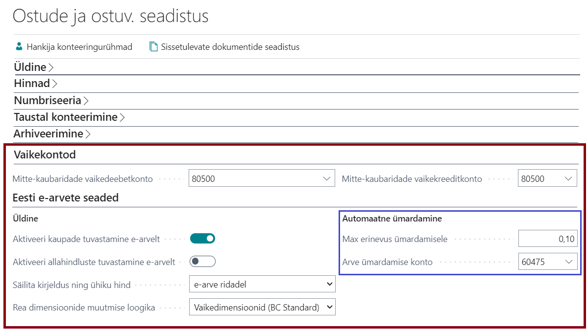

---
---
# Eesti e-arved | Kasutusjuhend

Eesti e-arve lahendus võimaldab teil vahetada e-arveid oma äripartneritega.

E-arve operaatoritena on toetatud: 
- RIK (Riigi Infosüsteemide Keskus)
- Finbite
- Unifiedpost

## Sisukord
  - [Videojuhend](#videojuhend)
  - [Teenuse seadistamine](#teenuse-seadistamine)
  - [Tööjärjekorra kanded](#tööjärjekorra-kanded)
  - [Andmevahetustegevuste logi](#andmevahetustegevuste-logi)
  - [E-arvete vastuvõtmine](#e-arvete-vastuvõtmine)
  - [E-arvete salvestamine ostuarveks](#e-arvete-salvestamine-ostuarveks)
  - [E-arvete saatmine](#e-arvete-saatmine)
  - [EU formaadis saatmise eeltingimused](#eu-formaadis-saatmise-eeltingimused)
  - [EU formaadis vastuvõetud arve töötlemise eeltingimused](#eu-formaadis-vastuvõetud-arve-töötlemise-eeltingimused)
  - [Põhiandmete saatmine](#põhiandmete-saatmine)

## Videojuhend

 
  
## Teenuse seadistamine

Avage **RIK dokumendivahetusteenuse seadistus**, **Finbite (Omniva) dokumendivahetusteenuse seadistus** või **Unifiedpost (FitekIn) dokumendivahetusteenuse seadistus** ning seadistage järgnevad väljad:

Kiirkaart / Väli | Operaator | Selgitus
|--|--|--|
**Üldine** |  | 
Lubatud | Kõik | Aktiveerib teenuse ning loob automaatse andmevahetuse jaoks vajalikud **ärjekorra kanded**.
Võtmekasutaja | Kõik | Tema rollikeskuse teatistesse saadetakse automaatsete andmevahetustööde käigus tekkivad vead, mis vajavad lahendamist.
Tegevuse logimine | Kõik | Määrab, millise detailsusega peetakse andmevahetuse tegevuste logi. Testperioodil on soovitav kasutada valikut „Tegevuse teade ja XML sõnumid“, et saada probleemide lahendamiseks maksimaalselt infot. Logitud teated ja sõnumid on vaadeldavad lehel Tegevuse logi.
Aktiveeri Peppol | Finbite | Aktiveerib e-arvete saatmise läbi Peppoli. Kliendi kaardil tuleb määrata vastav PeppolId.
Aktiveeri roaming | Unifiedpost | Aktiveerib rahvusvaheliste e-arvete saatmise Eesti e-arve formaati kasutades. Kliendi kaardil saab määrata vastava kanali (channelId) ning kanali aadressi (channelAddress).
e-müügiarvete formaat | Unifiedpost | Määrab e-arve formaadi, milles saadetakse e-müügiarved partnerile.
e-ostuarvete formaat | Unifiedpost | Määrab e-arve formaadi, milles e-ostuarved saabuvad partnerilt.
**Põhiandmed** |  | 
Ära asenda PR kontosid | Finbite | Määrab, et Finbite Arvekeskuses olemasolevaid PR kontosid ei tohi asendada saadetavate PR kontodega. Kui valitud, siis saadetud PR kontod mestitakse Finbite Arvekeskuses.
Ära asenda Dimensioone | Finbite | Määrab, et Finbite Arvekeskuses olemasolevaid dimensioone ei tohi asendada saadetavate dimensioonidega. Kui valitud, siis saadetud dimensioonid mestitakse Finbite Arvekeskuses. Soovitav kasutada, kui seotud dimensioonid on Finbite Arvekeskuses kasutusel.
Ära asenda Hankijaid ja kliente | Finbite | Määrab, et Finbite Arvekeskuses olemasolevaid Hankijaid ja kliente ei tohi asendada saadetavate Hankijate ja klientidega. Kui valitud, siis saadetud Hankijad ja kliendid mestitakse Finbite Arvekeskuses.
Saada ühes PR kontoga tähis kohustuslik dim. nõue | Unifiedpost | Määratleb kas ühes PR Kontodega saadetakse ka Tähis kohustuslik dimensioonid, mis Fitekin-is määratakse kohustuslikeks kuluobjektideks vastavale kontole.
Kustuta kasutamata põhiandmed uute saatmisel | Unifiedpost | Määratleb, kas kasutamata Kontod/Dimensiooniväärtused/Hankijad kustutatakse FitekIn-ist enne uute andmete lisamist.
**Dokumendid** |  | 
Võta arved muudetud alates | RIK, Finbite | Dokumendivahetuse sisemine järjehoida. Mittemuudetav.
Võta arved, mis on | Finbite | Määrab, millise olekuga ostuarved laetakse BC-sse:   a) Töödeldud - st peale nende töötlemist Finbite arvehalduses.   b) Vastu võetud - st kohe peale arve saabumist Finbite-i.   c) Kinnitatud - st peale arve kinnitamist Finbites.
Võta arve manused | RIK, Finbite | Määrab, kas võetakse e-arvega kaasasolevad manused. „Põhimanus“ on üljuhul arve PDF kujul.
**Ühendus** |  | Ühenduse vaikeväärtuste seadistamiseks saate kasutada tegevust Taasta URLide vaikeväärtused.
Teenuse saladus | RIK | Täpsustage Partnerilt.
Kliendi parool | RIK | Täpsustage Partnerilt.
Teenuse URL | Kõik | Finbite puhul leiate selle arvete halduse keskkonnast Üldinfo->Seaded->Andmevahetus ERP-ga.
Teenuse nimeruumi URL | Finbite, Unifiedpost | Vaikeväärtust ei ole vaja üldjuhul muuta.
SOAP nimeruumi URL | Finbite, Unifiedpost | Vaikeväärtust ei ole vaja üldjuhul muuta.
Autentimisfraas | Finbite | Leiate selle Finbite arvete halduse keskkonnast Üldinfo->Seaded->Andmevahetus ERP-ga.
Kasutajanimi | Unifiedpost | Täpsustage Unifiedpost’ist.
Parool | Unifiedpost | Täpsustage Unifiedpost’ist.

Ühenduse testimiseks kasutage tegevust **Testi ühendust**.

 

## Tööjärjekorra kanded

Teenuse aktiveerimisel luuakse automaatse andmevahetuse jaoks Tööjärjekorra kanded. Tööjärjekorra kannete vaatamiseks klikkige teenuse seadistuses **Tööjärjekorra kanded**.

Tööjärjekorra kanne | Parameetrijada | Selgitus
|--|--|--|
Saada PR kontod | SEND-ACC | Saadab PR kontod, millel on märge **Saada Finbite/FitekIn**.
Saada dimensioonid | SEND-DIM | Saadab dimensioonid, millel on märge **Saada Finbite/FitekIn**.
Saada hankijad | SEND-VEND	|  Saadab hankijad millel on märge **Saada Finbite/FitekIn**. Ainult Finbite - saab põhiandmetena saata ka kliente.
Võta ostuarved | GET-PINV	|  Võtab operaatori serverist ostuarved ning salvestab need tabelisse Sissetulevad dokumendid.
Saada kont. ostuarvete nr. | SEND-PINV-NO	|  Saadab konteeritud ostuarve numbri Finbite/FitekIn keskkonda.
Saada järjek. müügiarved | SEND-SINV |  Saadab konteeritud müügiarved (ning konteritud müügi kreeditarved), mille **E-arve olek** on „Ootab saatmist“ või „Saatmise tõrge“. Kliendil peab olema **Dokumendi saatmise profiil**, millel on seadistatud **Eesti e-arve**.
Saada järjek. hooldusarved | SEND-SMINV |  Saadab konteeritud hooldusarved (ning konteeritud hoolduse kreeditarved), mille **E-arve olek** on „Ootab saatmist“ või „Saatmise tõrge“. Kliendil peab olema **Dokumendi saatmise profiil**, millel on seadistatud **Eesti e-arve**.

Seadistage töödele soovitud sagedus ning aktiveerige iga töö tegevusega **Sea olekuks Valmis**. Käsitsi saab andmevahetuse tegevusi käivitada **RIK/Finbite/Unifiedpost dokumendivahetusteenuse seadistuse** toimingute ribalt.

 

## Andmevahetustegevuste logi

Kõik andmevahetuse tegevused logitakse. Tõrgete korral aitavad need teid probleemi lahendamisel. Andmevahetustegevuste logi sissekanded lingitakse andmetega järgnevalt:

Andmekirje / Leht | Andmevahetustegevus
|--|--|
RIK/Finbite/Unifiedpost dokumendivahetusteenuse seadistus | -Kontoplaani ja dimensioonide saatmine   -Hankijate ja klientide saatmine   -Ostuarvete vastuvõtmine
Sissetulev dokument | -Ostuarvega seotud manuste vastuvõtmine   -Konteeritud ostuarve nr. saatmine
Konteeritud müügiarve ( või kreeditarve) | -Müügiarve saatmine
Konteeritud hooldusarve ( või hoolduse kreeditarve) | -Hooldusarve saatmine

Logi sissekannete vaatamiseks klikkige seadistusel või dokumendil **Tegevuse logi**.

 

## E-arvete vastuvõtmine

E-arvete vastuvõtmine on tavaliselt seadistatud automaatseks tegevuseks. Selle kontrollimiseks avage **RIK/Finbite/Unifiedpost dokumendivahetusteenuse seadistus**, veenduge, et see on **Lubatud** ning klikkige **Tööjärjekorra kanded**. Avage töö „Võta ostuarved“ ning veenduge, et see on seadistatud ja töötab nii nagu soovite.

Juhul, kui soovite arvete vastuvõtmist kävitada käsitsi, saate seda teha teenuse seadistuse lehel tegevusega **Võta ostuarved**.

Vastu võetud e-arved salvestatakse tabelisse **Sissetulevad dokumendid**.

 

## E-arvete salvestamine ostuarveks

Lahenduse funktsionaalsust (sh ostuarveks salvestamisel ning loodud arve ridade info hoidmisel) saab juhtida **Ostude ja ostuv. seadistus** lehel:

- Sektsioonis **Vaikekontod** saab seadistada pearaamatu konto, mida süsteem kasutab arveridadele konto määramisel (vt all loogika punkt 5)
- Sektsioonis Eesti e-arvete seaded saab:
  - **Dokumendi loomine**:
    - Aktiveerida duplikaat dokumenti tuvastamise ostudokumendi loomisel (_et duplikaat avastada kohe loomisel, mitte alles konteerimisel_)
    - Aktiveerida kaupade tuvastamise funktsionaalsuse (vt all loogika punkt 2)
    - Määrata, kas e-arvest loodud ostudokumendil kasutada kaubakaardil määratud ostu mõõtühikut, e-arvel oleva mõõtühiku asemel
    - Aktiveerida allahindluste tuvastamise funktsionaalsuse (vt all loogika punkt 7)
    - Deaktiveerida e-arvelt KM toote konteeringurühma otsimine (Ära otsi e-arvelt KM koodi)
    - Määrata kas ning mis tingimustel leitakse Makse saaja hankija e-arve PayToName tag-i alusel
  - **Automatne ümardamine**:
    - Määrata automaatseks ümarduseks lubatud maksimaalse arve erinevuse kohalikus valuutas. Kui selles piires leitakse arve summa erinevus (sissetulevatest dokumentidest ostuarve loomisel), siis luuakse arvele lisarida, kasutades väljal "Arve ümardamise konto" määratud PR kontot
      - Lisaks tuleks "Pearaamatu seadistuses" määrata "Max lubatud KM erinevus", sest seda kasutatakse automaatseks KM erinevuste korrigeerimiseks (tavaliselt tekib arve summa vahe just tänu käibemaksu erinevusele)
    - Määrata PR konto, mida kasutatakse arve automaatsel ümardamisel:
      - Valitud kontol peaks kontoplaanis olema täidetud "Üld. toote konteeringurühm" ja "KM toote konteeringurühm"
      - "KM konteerimise seadistuses" peaks vastava "KM toote konteeringurühm" ridadel olema 0 (null) määranguga "KM %" (et automaatselt lisatav ümarduse rida ei tekitaks omakorda KM summa erinevust)
  - **Dokumendi töötlemine**:
    - Teha osturea andmete säilitamise määrangud (vt all Osturea andmete säilitamise määrangud)
    - Määrata, kas konteerimisel lubada sissetulnud e-arve ja loodud ostuarve summa erinevust (vajalik ainult erijuhtudel)

**Protsess:**

Avage **Sissetulevad dokumendid**. Valige saabunud e-arve, mille soovite salvestada ostuarveks ning klikkige **Loo dokument**.

Kui tegevus ebaõnnestus, siis vaadake **Sissetuleva dokumendi** kiirkaarti **Tõrked ja hoiatused**.

 

Automaatseks ostuarve loomiseks tuleks seadistada BC töövoog, kasutades malli **Sissetulevate dokumentide edastuse töövoog** (Incoming Document Exchange Workflow).

 

**E-arvest ostuarve loomisel kasutatakse järgnevat loogikat:**
1. **Hankija tuvastatakse** järgmises järjekorras:  
a) BC Hankija koodi alusel (XML-is "UniqueCode" tag)  
b) Registreerimisnumbri alusel  
c) KM Koodi alusel  
d) Nime alusel (süsteem otsib täpset vastet XML-is olevale hankija nimele)  
Hankija puudumisel on võimalus hankija automaatselt luua (eeldusel, et Riigid/regioonid tabelis on seadistatud Uue hankija mall) aga see ei ole soovituslik.  
_Finbite-ist tulevatel ostuarvel saab riigi määranguks olla "EE", "LT", "LV" või "ZZ", kus viimane tähistab kõiki ülejäänud riike. Seega tuleks luua Riigid/regioonid tabelisse välishankijat tähistav nn virtuaalne riik tähisega "ZZ"._
2. **Kaubad** tuvastatakse ainult juhul kui Hankija kaardil on **Dokumendi rea loomise loogika** määranguks on **Tuvasta kaubad**.  
Kaubad tuvastatakse järgmises järjekorras:  
a) BC kauba nr. (BuyerProductId tagis oleva koodi alusel)  
b) EAN (esmalt GTIN kauba kaardil, seejärel vöötkood kauba viidetes)  
c) Müüja kauba kood (esmalt kauba viidetes, seejärel kui on määratud **Kauba nr. võib olla SellerProductId** vaadatakse, kas vastavat BC kauba nr. leidub *(kuna Finbite-is käsitsi loodud kaubad saadetakse ka kui SellerProductId)*)  
3. **Kulukontod ja dimensioonid** võetakse e-arvest juhul, kui need on seal olemas – st. eelkonteerimine on tehtud operaatori arvehalduskeskkonnas.
4. Kui konto e-arvel puudub, siis kasutatakse **Vastenda tekst kontoks** funktsionaalsust, kust kõigepealt otsitakse e-arve rea kirjeldusele vastet ning kui seda ei leita, siis hankija nimele vastavat seadistust. **NB! Vastendamises on lubatud filtri kujul seadistused.**
5. Viimases järjekorras kasutatakse **Ostu ja ostuv. seadistus** lehel, **Vaikekontod** kiirkaardil määratud vaikekontosid.
6. **KM toote konteeringurühm** võetakse e-arvelt (juhul, kui see on seal olemas ning seadistuses KM toote konteeringurühma otsimine lubatud). Viimase puudumisel kasutatakse leitud kauba või PR konto vastavat määrangut.   NB! Kui e-arvel on väiksem KM %, kui kauba või PR konto KM toote konteeringurühmal, leiab süsteem esimese KM toote konteeringurühma (*kombinatsioonis hankija pealt tuleva KM äri konteeringurühmaga*), millel on sama KM % kui e-arve real, ning kasutab seda.
7. **Allahindlus** lisatakse arvereale ainult juhul kui **Aktiveeri allahindluste tuvastamine e-arvelt** on aktiveeritud **Ostu ja ostuv. seadistus** lehel ja kui e-arvel on allahindluse info leitav ning kui lisatud info läbib kontrollid (nt rea summa miinus rea allahindlus peab võrduma e-arve SumBeforeVAT summaga).

  

**Osturea andmete säilitamise määrangud**

Väli | Valikud ning selgitus
|--|--|
**Säilita kirjeldus ning ühiku hind** | Sellest määratlusest sõltub, kas peale muudatust ostuarve rea väljadel Nr. või Asukoha tähis säilitatakse muudatuse eelne info väljadel:   Kirjeldus/Märkus, Mõõtühiku tähis, Otsene ühikukulu, Rea hinnaalandi summa    a) Ei (BC Standardloogika) - st toimib Business Centrali standardloogika ehk nt PR Konto muutmisel kustub info ülaloetletud väljadelt.   b) e-arve ridadel - st kui arverida on XML-ist loodud, siis nt PR Konto muutmisel ei kao info ülaloetletud väljadelt.   c) kõikidel ridadel - st vahet pole, kas arverida pärineb e-arvelt või on käsitsi sisestatud, igal juhul ei kao info ülaloetletud väljadelt, kui muudetakse real välja Nr. või Asukoha tähis.    **NB!** Kui on tehtud valik b) või c), siis lahendus ei luba muuta rea tüüpi *(nt PR Konto asemele panna Kaup)*. Soovides rea tüüpi muuta, tuleks esmalt luua uus rida soovitud andmetega ning seejärel e-arvelt tekkinud rida kustutada.
**Rea dimensioonide muutmise loogika** | Sellest määratlusest sõltub, kuidas peale muudatust ostuarve rea väljadel Nr., Projekti nr, Projekti ülesande nr. muutuvad rea dimensioonid.    a) Vaikedimensioonid (BC Standard) - st toimib nagu seni, ehk real olevad dimensioonid sõltuvad sellest millised vaikedimensioonid reale tulevad.   b) Küsi kasutajalt - st iga muudatusega ülalloetletud väljadel kontrollitakse, kas dimensioonikogumi ID on muutunud ning kui on, siis küsitakse kasutajalt, kas muuta dimensioonid vastavalt vaikedimensioonide väärtustele. Kui kasutaja vastab Jah, siis muutuvad dimensioonid nagu valikuga a) ning kui vastab Ei, siis dimensioonid ei muutu.   c) Säilita e-arve ridadel - st juhul kui arverida on XML-ist loodud, siis lahendus säilitab enne muudatuse tegemist real olnud dimensiooniväärtused.

 

## E-arvete saatmine

Kui soovite kliendile saata arveid e-arvena, avage kliendi kaart ning määrake vastav **Dokumendi saatmise profiil**.
  
Rahvusvaheliste e-arvete saatmiseks aktiveerige Finbite-i tarbeks Peppol või Unifiedpost-i tarbeks roaming. Lisaks vaja Kliendi kaardil täita:

|Väli|Selgitus|
|--|--|
|Kanal (ChannelId)|Määratleb Unifiedposti jaoks rahvusvahelise kliendi kanali ID (nt PEPPOL, fEAb, INEX, ERIGA). Väärtus lisatakse XML-is Invoice tagi atribuudina channelId.|
|PeppolId või Channel-i aadress|Määratleb Finbite jaoks kliendi Peppoli ID (nt 0192:979920261), mida kasutatakse XML-is PartyEN laienduses. Unifiedposti jaoks aga määratleb kliendi rahvusvahelise kanali aadressi (sh PeppolId ning selle saab kliendi käest või <a href="https://directory.peppol.eu/" target="_blank">Peppol Directory-st</a> või soome puhul vt. <a href="https://verkkolaskuosoite.fi" target="_blank">verkkolaskuosoite.fi</a>). Väärtus lisatakse XML-is Invoice tagi atribuudina channelAddress.| 

Kui e-arve profiil puudub, avage **Dokumendi saatmise profiilid** ning looge uus profiil:

Väli | Väärtus / Selgitus
|--|--|
Tähis | "E-ARVE"
Kirjeldus | "E-arve"
Eesti e-arve | Valige oma operaator
Saada Eesti e-arve automaatselt | Konteeritud arve E-arve olek saab väärtuse "Ootab saatmist" ja saadetakse Tööjärjekorra tööga "Saada järjekorras müügiarved"
Ära lisa PDF-i e-arvele | PDF väljatrükki ei lisata e-arvele. _(Vajalik, kui väljatrükk luuakse e-arve operaatori poolt või kui on vaja e-arvete loomist ja väljasaatmist kiirendada)_
Ära saada null summaga arvet | Automaatselt ei saadeta arveid, mille summa on 0 (null)
Finbite kättetoimetamisviis | Valige sobiv (vaikeväärtus tühi tähendab, et kanali otsustab Finbite). NB! Kui valikuks on Pank, siis edastatakse serviceId-na konteeritud arvelt makse viitenumber ning channelId-na maksja kliendikaardilt eelistatud pangakonto IBAN.
Finbite arvehaldus | Kas müügiarve läheb kohe kliendile või esmalt Finbite arvehaldusesse (viimases tuleb siis manuaalselt müügiarve kliendile edasi saata).

 

E-arve saatmiseks kasutage arvel tegevust **Konteeri ja saada** või juba konteeritud arvel tegevust **Saada**.  
*Kui kliendile on määratud dokumendi saatmise profiil, kus aktiveeritud "Saada Eesti e-arve automaatselt", siis saadetakse e-arved tööjärjekorraga ka lihtsalt tegevust **Konteeri** kasutades.*

 

Saatmise oleku kohta annab infot konteeritud arve väli **E-arve olek**:

Väärtus | Selgitus
|--|--|
Ootab saatmist | Dokumenti ei ole veel ära saadetud aga seda teeb hiljem tööjärjekord (kui viimane on aktiveeritud).
Saatmistõrge | Dokumendi saatmisel tekkis tõrge.
Saadetud Finbite | Dokument on saadetud e-arve operaatorile Finbite.
Saadetud Unifiedpost | Dokument on saadetud e-arve operaatorile Unifiedpost.

Saatmata e-arveid saadab perioodiliselt tööjärjekorra töö „Saada järjek. müügiarved“.

Töö saadab arveid, mis vastavad järgnevatele tingimustele:

-   arve **E-arve olek** on „Ootab saatmist“ või „Saatmise tõrge“
-   kliendi **Dokumendi saatmise profiili** valik **Eesti e-arve** on täidetud.

Juhul, kui arve saatmisel tuleb tõrge, et dokument on juba saadetud aga sellest hoolimata soovitakse saata mingil põhjusel e-arve uuesti, siis saab konteeritud müügiarvete (samuti konteeritud hooldusarvete ning müügi- ja hoolduse kreeditarvete) registris valida toimingu **Saada...** ning avanenud aknas märkida **Saada juba saadetud e-arve uuesti**.  

Juhul, kui arve saatmisel on tõrge, mida ei ole võimalik lahendada, siis on soovitav peatada arve saatmiskatsed.  
Selleks klikkige arve väljal **E-arve olek**, mis avab andmevahetustegevuste logi. Logi sulgemisel saate valida, kas soovite saatmise peatada.  

 

## EU formaadis saatmise eeltingimused

**NB! Allolevat on vaja ainult juhul, kui e-müügiarvete formaadiks on seadistuses valitud "EU Peppol BIS3 UML"** - st. et BC-st läheb arve PEPPOL formaadis välja (hetkel toetab seda ainult Unifiedpost). _Kui saadetakse e-arve PEPPOL kliendile aga nii, et BC-st läheb välja Eesti e-arve formaadis arve, mille operaator ise konverteerib PEPPOL formaati, siis allolevat pole vaja._  

**Selleks, et õnnestuks EU formaadis loodud e-müügiarvete saatmine peab olema täidetud mõned tingimused:**
- Riikide tabelis peab olema “KM skeem” väli täidetud. Nt Eesti puhul määrata väärtuseks 0191
  
- KM konteerimise seadistuses peab olema “Maksukategooria” korrektse väärtusega täidetud
  
- Konteeritud müügiarvel peab olema “Teie viide” täidetud .

 

## EU formaadis vastuvõetud arve töötlemise eeltingimused

Selleks, et õnnestuks EU formaadis vastuvõetud e-ostuarve töötlemine peab olema täidetud mõned tingimused:
- Andmevahetuse määratlustes peab olema PEPPOL arve ja kreeditarve tähised loodud (nt kasutades Andmete käsitsemise koodiplokki 1214 ja Lugemise/kirjutamise koodiplokki 1203)
- Andmevahetuse liikides peab olema vastavad viited PEPPOL arve ja kreeditarve andmevahetuse määratlusele
  - Näidisena saab kasutada Cronus ettevõtte seadistusi.

 

## Põhiandmete saatmine

Finbite arvehaldusesse ja FitekIn-i on võimalik saata järgmised põhiandmed:
- **PR kontod** _(FitekIn puhul võimalik kaasata ka kohustuslikud kuluobjektid)_
- **Dimensioonid** _(FitekIn puhul peab seal olema kuluobjekt loodud)_
- **Hankijad** _(Finbite puhul võimalik saata ka kliendid)_

Vastavates registrites tuleb märkida on väli **Saada Finbite/FitekIn** nendele kirjetele, mida soovite Finbite-i edastada.
 
Andmete saatmiseks ühekordselt avage vastav **Dokumendivahetusteenuse seadistus** ning käivitage Toimingud -> Põhiandmed alt vastav tegevus:
- **Saada PR kontod**
- **Saada dimensioonid**
- **Saada hankijad** (ja kliendid)

 Andmeid saadetakse perioodiliselt, kui teil on seadistatud ja töötavad vastavad tööjärjekorra kanded.

----------

Täpsema info saamiseks, palun võtke ühendust partneriga:  
<a href="https://dynamicspartnersee.github.io/docs/en-us/contacts" target="_blank">Estonian Dynamics Partners</a>
