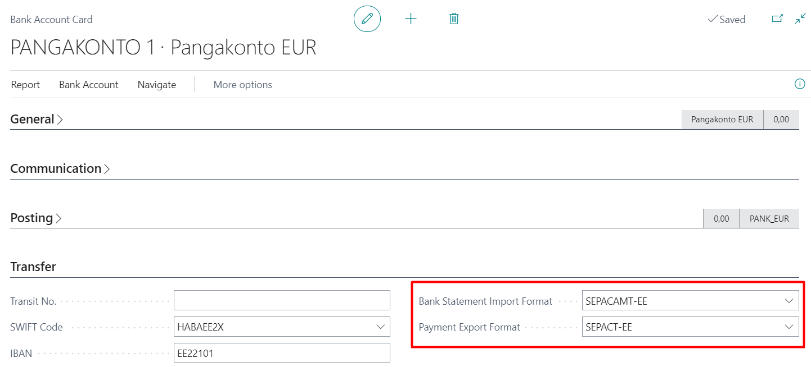

---
---
# Estonian Banking Formats - User Guide
This extension adds Estonian localization for banking functionality in Dynamics 365 Business Central.

Estonian localization includes:
- Payment reference numbers for sales- and service invoices
- Sales document layouts (Order, Invoice, Cr. Memo) with commonly used requisites
- Estonian SEPA payment format
- Estonian SEPA statement format
- Payment application rules
- Improvements to Suggest vendor payments and Message to Recipient and Description content
- Improvement to employee payments for Message to Recipient content
- Automatic rounding of sales documents according to payment method
  
## Install activities
After the installation of extension page **Estonian Banking Formats Setup** must be opened, because this triggers the background installation of formats needed (_Data Exchange Definitions, Bank Export/Import Setup, Document Layouts_).  
Page must be opened in every company, where Estonian Banking Formats shall be used.  

## Payment Reference Numbers for Sales and Service Invoices
Using payment reference numbers in sales helps you apply cash receipts and invoices when processing bank statements.

To use payment reference numbers in sales- and service invoices, open **Estonian Banking Formats Setup** and set **Sales Reference No.** as:
- *Create from Customer No.* - In this case, the **Payment Refernece No.** will be generated for new customers and then taken from customers to the new sales- and service invoices.
- *Create from Invoice No.* - In this case, if **Payment Refernece No.** on sales invoice header is empty before posting, then it will be generated from invoice number in the posting process. For service invoices it will always be generated from service invoice number.

## Sales Document Layouts
Three new custom layouts has been added to provide commonly used company and banking information on sales documents:
- *1305 - Estonian Order Confirmation*
- *1306 - Estonian Sales Invoice*
- *1307 - Estonian Sales Credit Memo*

You can see if layouts are installed in **Estonian Banking Formats Setup**. If not installed, please contact your partner.

## Bank Statement Import Format (SEPA Statement Format)
To be able to import bank statements from bank to Business Central, Estonian SEPA statement format has been added.  
You can see if format is installed in **Estonian Banking Formats Setup**. If not installed, please contact your partner.  
To setup statement format for a bank account, open **Bank Accounts** and edit bank account you would like to setup.  
Choose **SEPACAMT-EE** for **Bank Statement Import Format**.  

## Payment Export Format (SEPA Payment Format)
To be able to submit payments from Business Central to bank, Estonian SEPA payment format has been added.  
You can see if format is installed in **Estonian Banking Formats Setup**. If not installed, please contact your partner.  
To setup payments format for a bank account, open **Bank Accounts** and edit bank account you would like to setup.  
Choose **SEPACT-EE** for **Payment Export Format**.  

In certain cases (usually with LHV statements), an import situation arises where both the Payer's name and the Recipient's name always appear in the **Payment Reconciliation Journal** field **Related-Party Name**. Understandably, one of these names is always the company's own name.

To prevent this, a transformation rule **REMOVE_COMPANY_NAME** has been added, which can be used if necessary when mapping the data exchange definition field. Therefore, for the LHV XML statement, the transformation rule should be applied to the **Field Mapping** rows of **Data Exchange Definition** table 274, where Field ID = 15 (Payer/Recipient Name), so that the Payer/Recipient Name does not include the company's own name.  
  

## Payment Application Rules
Business Central payment application rules have been complemented by two new components:
- *Reference No.* - helps in the process of document matching.
- *Registration No.* - helps in the process of customer/vendor match.

New rules does not require setup and thus are not visible in **Payment Application Rules**.  
Rules are used on action **Apply Automatically** in **Payment Reconciliation Journal**.  
_Note! (from BC21) It's reccommended to set **Disable Automatic Payment Matching** to true on **Bank Account Card** in order to avoid running BC standard application process during bank statement import (since it's not using Reference numbers to match, it's slower and less accurate)._  

## Payments to Vendor improvements
With action **Suggest Vendor Payments** in Payment Journals:
- Selection **Only payments to Same Bank** suggests only payments to these vendors, that have a bank account in the same bank as "Bal. Account No." bank specified on journal batch
  - Solution searches for vendors with a bank account in the same bank and if finds then sets it to Recipient Bank Account
  - Solution is active only then when batch has Bal. Account Type as Bank Account and Bal. Account No. has bankaccount with IBAN.
- Selection **and per Payment Reference** summarizes payments per vendor and payment reference combination
  - Payments, that have same reference numbers are summarized.
    - When planning to post suggested entries, please make selection **New Doc. No. per Line**, to avoid applied invoices and payments confusion during posting.
- Summarized payment's **Message to Recipient** consits of all summarized invoice numbers 
  - If there are so many summarized invoices, that Message to recipient field comes full, then the rest of information is cut from the end.
  - If in Vendor Ledger Entries there is Message to recipient field filled then that is used instead of External Document No.
- **Message to Recipient takes into account Language code** specified on Vendor card 
  - English and Estonian is supported

## Applied entries description improvements
In journals (incl. Cash Receipt Journal) action **Apply Entries** and in Payment Journal action **Suggest Vendor Payments** inserts also applied invoice numbers to journal field **Description** (_standard just entered there Customer/Vendor name_).  

Improvement is activated by default, but can be deactivated on **Estonian Banking Formats Setup** page by selecting **Use Non-localized Description when applying entries**. Additionally it's possible to activate **Use Ext. Doc. No. if Possible** in order to use external document numbers instead of BC Sales Invoice numbers.  

## Payment recipient change
In case the payment recipient differs from the vendor (for example recipient is factoring company or Ministry of Finance), fill in data under **Recipient** tab on the **Vendor Bank Account Card**.  
If the **Recipient Name** is filled, it is also used in the payment file.  

## Automatic rounding of sales documents
On **Estonian Banking Formats Setup** page, you can activate the **Use Payment Term Sales Inv. Rounding** setting, and then a field **Inv. Rounding Precision (LCY)** will appear in the payment methods, and a field **Invoice Amount Incl. Rounding** will appear on the sales documents.  
When posting the invoice, an additional line with the amount to be rounded will be created on the sales invoice, similar to the standard. The G/L Account, where the rounded amount is posted, is taken from the **Invoice rounding account** field in the Customer posting groups.  

***

For more information, please contact:  
<a href="https://dynamicspartnersee.github.io/docs/en-us/contacts" target="_blank">Estonian Dynamics Partners</a>
