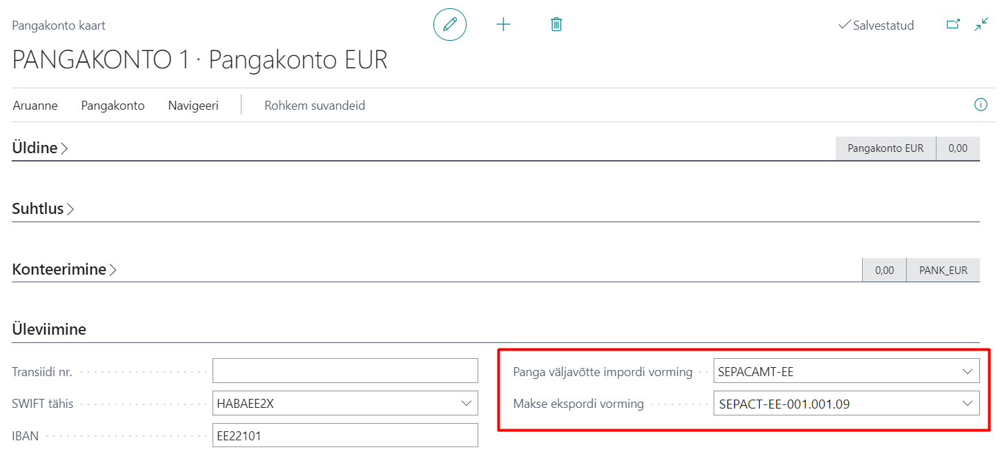

---
---
# Eesti pangaformaadid - kasutajajuhend
Laiendus lokaliseerib Dynamics 365 Business Central pangafunktsionaalsuse Eesti nõuetele vastavaks.

**Eesti lokalisatsioon sisaldab:**
- Kliendi- või arvepõhised viitenumbrid müügiarvetel
- Pangarekvisiitide täiendused müügidokumendite kujundustel (tellimus, arve, kreeditarve)
- Eesti SEPA makseformaat
- Eesti SEPA väljavõtteformaat
- Viitenumbrit ja registreerimisnumbrit arvestavad maksete sidumisreeglid
- Hankijale maksete loomise täiendused

## Installeerimise tegevused
Peale laienduse installeerimist tuleb avada leht **Eesti pangaformaatide seadistus** (_Estonian Banking Formats Setup_), sest lehe avamine käivitab taustal formaatide installeerimise (_Andmevahetuse määratlused, Panga ekspordi/impordi seadistus, Dokumendi kujundused_).  

Leht tuleb avada igas ettevõttes, kus soovitakse Eesti pangaformaate kasutada.  

## Viitenumbrid müügis
Müügiarvetel viitenumbrite kasutamine aitab hiljem väljavõtte töötlemisel laekumisi käsitleda.

Müügis viitenumbrite kasutamiseks avage **Eesti pangaformaatide seadistus** ja määrake **Müügi viitenr.** ühena alljärgnevast:

Väärtus | Selgitus
-- | --
Loo kliendi numbrist | **Makse viitenr.** genereeritakse uue kliendi loomisel ja kantakse edaspidi kliendi pealt kaasa tema arvetele.
Loo arve numbrist | **Makse viitenr.** genereeritakse konteerimise käigus müügiarve numbrist. Seda juhul, kui **Makse viitenr.** puudus enne konteerimist.

## Müügidokumentide kujundused
Lisatud on kolm uut dokumendi kujundust, millel on toodud Eestis üldlevinud kujul ettevõtte- ja pangarekvisiidid:
-  *1305 - Estonian Order Confirmation*
-  *1306 - Estonian Sales Invoice*
-  *1307 - Estonian Sales Credit Memo*

## Maksete sidumise reeglid
Business Central'i makse sidumisreegleid on täiendatud järgnevate komponentidega: 
-  *Viitenumber* - aitab dokumendi vastendamisel.
-  *Registreerimisnumber* - aitab kliendi/hankija vastendamisel.

Täiendavad reeglid ei vaja seadistamist ja ei ole nähtavad **Maksete sidumisreeglites**.  
Täiendatud reegleid kasutatakse **Maksete sobitamise žurnaali** tegevusel  **Seo automaatselt**.

## Panga väljavõtte impordi vorming (SEPA väljavõtteformaat)
Pangaväljavõtete importimiseks Business Central'isse on lisatud Eesti SEPA väljavõtteformaadi tugi.  
Kas formaat on installitud, saate kontrollida **Eesti pangaformaatide seadistuses**. Kui ei ole, võtke ühendust oma partneriga.  
Formaadi seadistamiseks pangakontole avage **Pangakontod** ja redigeerige soovitud kontot.  
Määrake **SEPACAMT-EE** väljal **Panga väljavõtte impordi vorming**.  

## Makse ekspordi vorming (SEPA makseformaat)
Business Central'is koostatud maksete panka edastamiseks on lisatud Eesti SEPA makseformaadi tugi.  
Kas formaat on installitud, saate kontrollida **Eesti pangaformaatide seadistuses**. Kui ei ole, võtke ühendust oma partneriga.  
Formaadi seadistamiseks pangakontole avage **Pangakontod** ja redigeerige soovitud kontot.  
Määrake **SEPACT-EE** väljal **Makse ekspordi vorming**.

## Hankijale maksete loomise täiendused
Maksežurnaalis olevas toimingus **Soovita makseid hankijale** saab:
- Valiku **Ainult samasse panka maksed** abil filtreerida tasumisele kuuluvate maksete hulgast välja ainult need, mis läheksid samasse panka, millelt toimub väljamakse
  - Lahendus otsib hankija pangakontode hulgast vastava panga kontot ning kui leiab, siis määrab selle Saaja pangakontoks.
  - Lahendus on aktiivne ainult siis, kui maksežurnaali töölehele on valitud Korr. Konto liigiks Pangakonto ning Korr. konto nr. pangakonto, millel IBAN täidetud.
- Valiku **ja viitenumbri alusel** abil saab summeerida makseid kombinatsioonis hankija ja viitenumber
  - Valiku tulemusena pannakse sama viitenumbriga arved kokku ühele maksele.
- Summeerimise puhul tulevad makse selgitusse kõik summeeritud arvete numbrid
  - Kui summeeritud arveid on niipalju, et Teade saajale väli maksežurnaalis saab täis (140 tähemärki), siis ülejääv osa lõigatakse ära.
  - Kui hankijaandmiku kandel on täidetud väli Teade saajale, siis kasutatakse välise dokumendi nr. asemel infot sellelt väljalt.
- Maksete selgituse koostamisel arvestatakse Hankija kaardil oleva keele tähisega
  - Toetatud on eesti ja inglise keel

## Makse saaja
Kui makse saaja on erinev hankijast (näiteks on saajaks faktooring või Rahandusministeerium), lisage andmed **Hankija pangakonto kaart** kiirkaardil **Saaja**.  
Kui **Saaja nimi** väli on täidetud, kasutatakse antud nime ka maksefailis. 

***

Täpsema info saamiseks võtke palun ühendust oma partneriga:  
[http://www.dynamicspartners.ee](http://www.dynamicspartners.ee)
