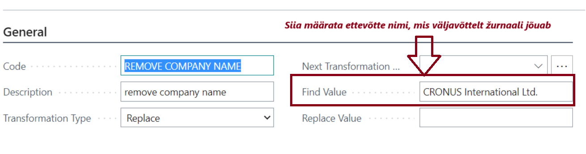

---
---
# Eesti pangaformaadid - kasutajajuhend
Laiendus lokaliseerib Dynamics 365 Business Central pangafunktsionaalsuse Eesti nõuetele vastavaks.

**Eesti lokalisatsioon sisaldab:**
- Kliendi- või arvepõhised viitenumbrid müügi- ja hooldusarvetel
- Pangarekvisiitide täiendused müügidokumendite kujundustel (tellimus, arve, kreeditarve)
- Eesti SEPA makseformaat
- Eesti SEPA väljavõtteformaat
- Viitenumbrit ja registreerimisnumbrit arvestavad maksete sidumisreeglid
- Hankijale maksete soovitamise ja teade saajale ning kirjeldus täiendused maksežurnaalis
- Töötajale maksete puhul teade saajale ning kirjeldus täiendused
- Müügidokumentide automaatne ümardamine lähtuvalt makseviisist

## Installeerimise tegevused
Peale laienduse installeerimist tuleb avada leht **Eesti pangaformaatide seadistus** (_Estonian Banking Formats Setup_), sest lehe avamine käivitab taustal formaatide installeerimise (_Andmevahetuse määratlused, Panga ekspordi/impordi seadistus, Dokumendi kujundused_).  

Leht tuleb avada igas ettevõttes, kus soovitakse Eesti pangaformaate kasutada.  

## Viitenumbrid müügi- ja hooldusarvetel
Müügi- ja hooldusarvetel viitenumbrite kasutamine aitab hiljem väljavõtte töötlemisel laekumisi käsitleda.

Müügi- ja hooldusarvetel viitenumbrite kasutamiseks avage **Eesti pangaformaatide seadistus** ja määrake **Müügi viitenr.** ühena alljärgnevast:

Väärtus | Selgitus
-- | --
Loo kliendi numbrist | **Makse viitenr.** genereeritakse uue kliendi loomisel ja kantakse edaspidi kliendi pealt kaasa tema arvetele.
Loo arve numbrist | **Makse viitenr.** genereeritakse konteerimise käigus müügi- või hooldusarve numbrist. Seda juhul, kui **Makse viitenr.** puudus enne konteerimist müügiarvelt.

## Müügidokumentide kujundused
Lisatud on kolm uut dokumendi kujundust, millel on toodud Eestis üldlevinud kujul ettevõtte- ja pangarekvisiidid:
-  *1305 - Estonian Order Confirmation*
-  *1306 - Estonian Sales Invoice*
-  *1307 - Estonian Sales Credit Memo*

## Maksete sidumise reeglid
Business Central'i makse sidumisreegleid on täiendatud järgnevate komponentidega: 
-  *Viitenumber* - aitab dokumendi vastendamisel (sh kiirendab automaatse sidumise toimingut).
-  *Registreerimisnumber* - aitab kliendi/hankija vastendamisel.

Täiendavad reeglid ei vaja seadistamist ja ei ole nähtavad **Maksete sidumisreeglites**.  
Täiendatud reegleid kasutatakse **Maksete sobitamise žurnaali** toimingul **Seo automaatselt**.  

## Panga väljavõtte impordi vorming (SEPA väljavõtteformaat)
Pangaväljavõtete importimiseks Business Central'isse on lisatud Eesti SEPA väljavõtteformaadi tugi.  
Kas formaat on installitud, saate kontrollida **Eesti pangaformaatide seadistuses**. Kui ei ole, võtke ühendust oma partneriga.  
Formaadi seadistamiseks pangakontole avage **Pangakontod** ja redigeerige soovitud kontot.  
Määrake **SEPACAMT-EE** väljal **Panga väljavõtte impordi vorming**.  

## Makse ekspordi vorming (SEPA makseformaat)
Business Central'is koostatud maksete panka edastamiseks on lisatud Eesti SEPA makseformaadi tugi.  
Kas formaat on installitud, saate kontrollida **Eesti pangaformaatide seadistuses**. Kui ei ole, võtke ühendust oma partneriga.  
Formaadi seadistamiseks pangakontole avage **Pangakontod** ja redigeerige soovitud kontot.  
Määrake **SEPACT-EE-001.001.09** väljal **Makse ekspordi vorming**.  

Teatud juhtudel (üldjuhul LHV väljavõttega) tekib importimisel olukord, kus **Maksete sobitamise žurnaalis** väljale **Maksja/Saaja nimi** tulevad alati mõlemad - st nii Maksja nimi, kui Saaja nimi.  
Arusaadavalt on üheks selliseks nimeks alati ettevõtte enda nimi.  
**Selle vältimiseks** on lisatud **teisendusreegel** **REMOVE_COMPANY_NAME**, mida saab vajadusel kasutada andmevahetusmääratluse välja vastendamisel. 
Seega LHV XML väljavõtte puhul tuleks teisendusreegel panna külge **Andmevahetuse määratluse** tabeli 274 **Välja vastendamine** ridadele, mille Välja ID = 15 (Maksja/Saaja nimi), selleks et Maksja/Saaja nimi ei sisaldaks ettevõtte enda nime.  

NB! Eelnevalt vaadata väljavõttest või maksete sobitamise žurnaalist, millisel kujul kõige enam ettevõtte nimi esineb ning seejärel määrata vastav nimi teisendusreegli väljale **Leia väärtus**, selleks et süsteem selle importimisel üles leiaks.  

  

## Hankijale maksete loomise täiendused
Maksežurnaalis olevas toimingus **Soovita makseid hankijale** saab:
- Valiku **Ainult samasse panka maksed** abil filtreerida tasumisele kuuluvate maksete hulgast välja ainult need, mis läheksid samasse panka, millelt toimub väljamakse
  - Lahendus otsib hankija pangakontode hulgast vastava panga kontot ning kui leiab, siis määrab selle Saaja pangakontoks.
  - Lahendus on aktiivne ainult siis, kui maksežurnaali töölehele on valitud Korr. Konto liigiks Pangakonto ning Korr. konto nr. pangakonto, millel IBAN täidetud.
- Valiku **ja viitenumbri alusel** abil saab summeerida makseid kombinatsioonis hankija ja viitenumber
  - Valiku tulemusena pannakse sama viitenumbriga arved kokku ühele maksele.
    - NB! Kui maksežurnaalist plaanis read ära koknteerida, siis tuleks aktiveerida aruande päringuaknas valik "Uus dok. nr. rea kohta", selleks et konteerimisel oleks iga seotud viitenumbriga makse eristatud.
- Summeerimise puhul tulevad makse selgitusse kõik summeeritud arvete numbrid
  - Kui summeeritud arveid on niipalju, et Teade saajale väli maksežurnaalis saab täis (140 tähemärki), siis ülejääv osa lõigatakse ära.
  - Kui hankijaandmiku kandel on täidetud väli Teade saajale, siis kasutatakse välise dokumendi nr. asemel infot sellelt väljalt.
- Maksete selgituse koostamisel arvestatakse Hankija kaardil oleva keele tähisega
  - Toetatud on eesti ja inglise keel

## Töötajale maksete puhul teade saajale ning kirjeldus täiendused
**Eesti pangaformaatide seadistuses** saab **Makse teade töötajale** välja kaudu valida, millisel kujul luuakse maksežurnaali välja "Teade saajale" sisu, kui luuakse makse töötajale. 

## "Seo kanded" ning "Seo käsitsi" toimingute täiendused
Žurnaalides (sh laekumisžurnaalis) olevat toiminguid "Seo kanded" ja "Seo käsitsi" ning maksežurnaalis "Soovita makseid hankijale" on täidendatud loogikaga, et žurnaali rea väljale kirjeldus tulevad lisaks seotud osapoole nimele ka seotud arvete numbrid (_standard märkis sinna lihtsalt seotud osapoole ehk kliendi/hankija nime_).  

Funktsionaalsus on vaikimisi aktiveeritud, kuid seda saab väja lülitada **Eesti pangaformaatide seadistuses** valides **Kasuta lokaliseerimata kirjeldust kannete sidumisel**. Lisavõimalusena saab aktiveerida **Kasuta sidumisel välise dok. nr. kui võimalik** valiku, mis BC arve numbrite asemel kasutab välise dokumendi numbreid kirjelduse väljal (mõistlik siis sisse lülitada, kui arved luuakse välises süsteemis).  

## Makse saaja nime muutmine maksel
Kui makse saaja on erinev hankijast/kliendist (näiteks on saajaks faktooringettevõte või Rahandusministeerium), lisage andmed **Hankija/Kliendi pangakonto kaart** kiirkaardil **Makse saaja**.  
Kui **Saaja nimi** väli on täidetud, kasutatakse antud nime ka maksefailis (hankija/kliendi nime asemel).  

## Müügidokumentide automaatne ümardamine vastavalt makseviisile
_Mõeldud alates 2025 jõustuva <a href="https://www.eestipank.ee/press/1-ja-2-sendised-ning-umardamisreegel" target="_blank">sularahamaksetel 1-ja 2-sendiste kadumise</a> lahendamiseks._  
**Eesti pangaformaatide seadistus** lehel saab aktiveerida **Kasuta müügiarvete ümardamist makseviisidega** määrangu ning seejärel tuleb nähtavale makseviisides väli **Arve ümardamistäpsus (KV)** ning müügidokumentidel väli **Arve summa arv. ümardust**.  
Kui müügidokumendile lisatakse **makseviis**, kuhu on määratud **Arve ümardamistäpsus (KV)**, siis hakkab **Arve summa arv. ümardust** näitama ümardatud arve summat peale konteerimist.  
Arve konteerimisel luuakse analoogselt standardile müügiarvele täiendav rida ümardamisele kuuluva summaga (PR Konto, kuhu ümardatav summa konteeritakse, võetakse Kliendi konteeringurühmad väljalt **Arvete ümardamise konto**).  

***

Täpsema info saamiseks võtke palun ühendust oma partneriga:  
<a href="https://dynamicspartnersee.github.io/docs/en-us/contacts" target="_blank">Estonian Dynamics Partners</a>
