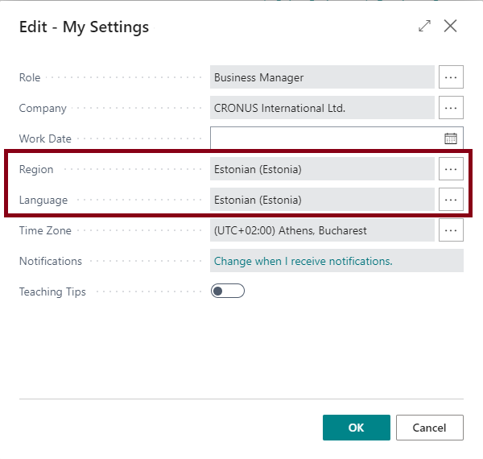
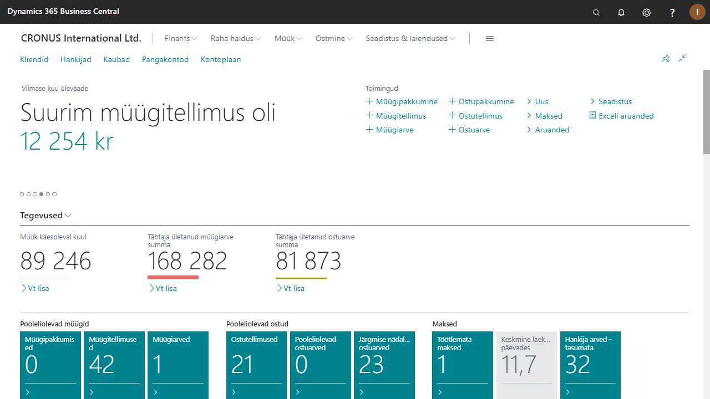

---
---
# Estonian Language - Kasutusjuhend
## Kontrolli, et Eesti keele laiendus on installeeritud
Ava **Extension Management** (Laienduste haldus) ja kontrolli, et laiendus nimega 'Estonian Language (Estonia)' oleks staatusega 'Installed'.  
Kui ei ole, siis palun võta ühendust oma partneriga.  

## Kuidas muuta rakenduse keeleks Eesti keel
Rakenduse saab Eesti keelseks, kui avada **My Settings** (Minu sätted) ning määrata keeleks (**Language**) 'Estonian (Estonia)'.  

Kuvamaks numbreid ja kuupäevi Eestis kasutatavas formaadis, tuleks määrata Regiooniks (**Region**) samuti 'Estonian (Estonia)'.  

Tehtud määratlused rakenduvad vajutades nupule **OK**.

Nüüd peaks Dynamics 365 Business Central olema eesti keeles.

***

Lisainformatsiooni saamiseks pöördu partneri poole:  
<a href="http://www.dynamicspartners.ee/" target="_blank">www.dynamicspartners.ee</a>
